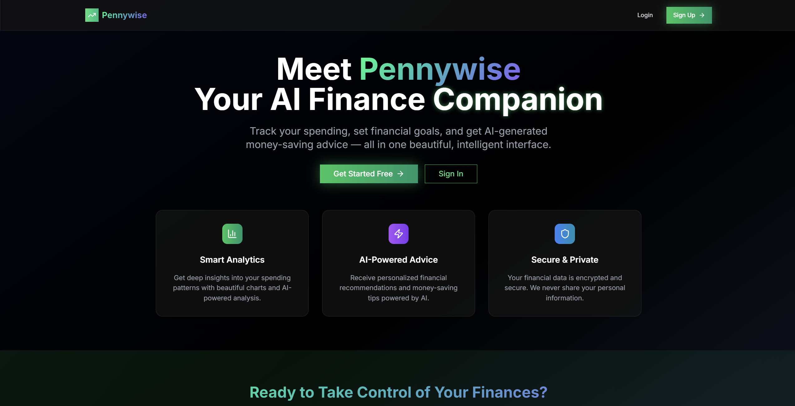
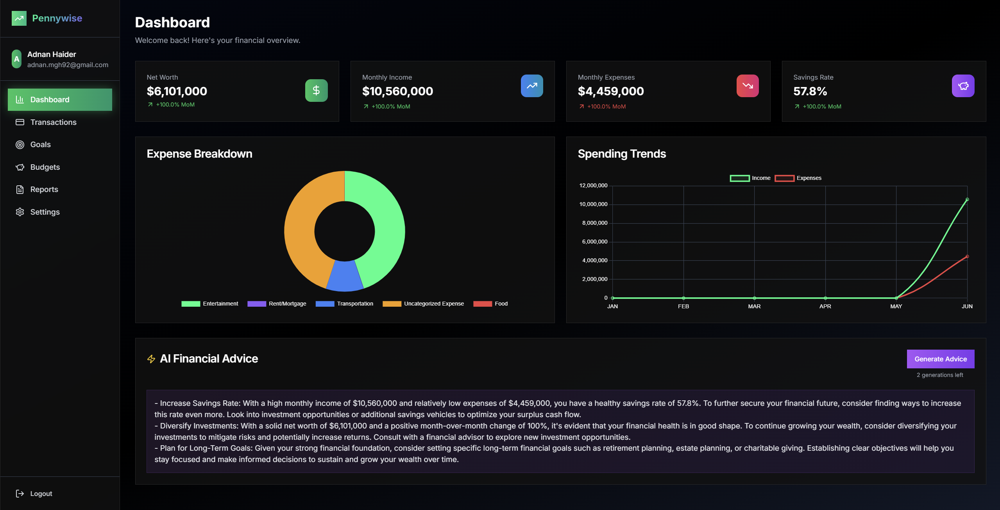
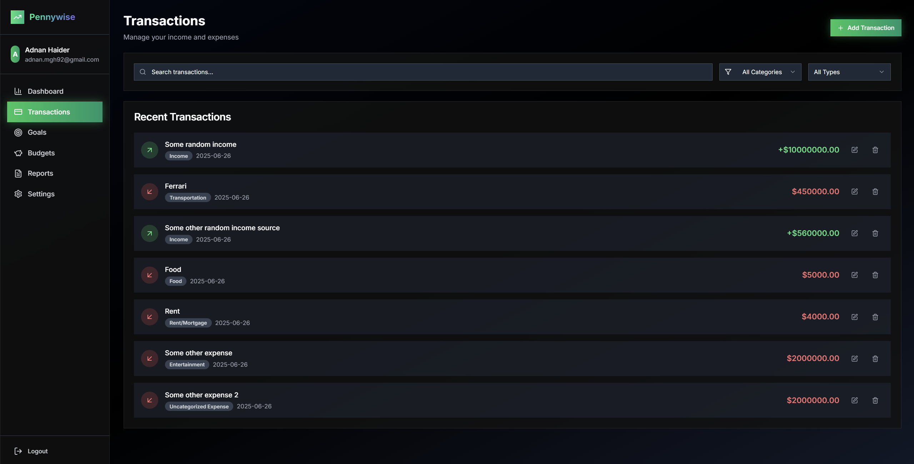

# Pennywise 💰 — Personal Finance Manager
*A modern full-stack web application that helps users track income, expenses, budgets, and net-worth while delivering GPT-powered financial insights.*

[**Live&nbsp;Demo →**](https://pennywise-fullstack.vercel.app/) • Built with **Next.js (React)**, **Spring Boot 3**, **PostgreSQL/Supabase**, **Tailwind CSS**, **JWT**, **OpenAI Chat Completions**

---

## Table of Contents
1. [Screenshots](#screenshots)
2. [Why Pennywise?](#why-pennywise)
3. [Feature Highlights](#feature-highlights)
4. [Tech Stack & Architecture](#tech-stack--architecture)
5. [Quick Start (Local Dev)](#quick-start-local-dev)
6. [Environment Variables](#environment-variables)
7. [Deployment Notes](#deployment-notes)
8. [Project Structure](#project-structure)
9. [Roadmap](#roadmap)
10. [Contributing](#contributing)

---

## Screenshots

### Welcome / Login  


### Dashboard  


### Transactions  


---

## Why Pennywise?
I built Pennywise to **demonstrate real-world full-stack engineering skills**—from database design and secure JWT auth to modern React UI patterns and cloud deployment. The app mirrors production concerns employers care about:

* **Domain complexity** – budgeting logic, month-over-month deltas, savings-rate math  
* **Clean architecture** – separate Next.js frontend + Spring Boot backend, DTO layers, service tests  
* **Dev-ops literacy** – environment-aware configs, session-pooled Postgres on Supabase, CI-friendly Maven/Node builds  
* **AI integration** – OpenAI GPT model generates context-aware suggestions per user based on live transactional data  

---

## Feature Highlights

| Module | Capabilities |
|--------|--------------|
| **Authentication** | Secure registration & login, BCrypt password hashing, stateless JWT stored in `HttpOnly` cookies / `localStorage` |
| **Dashboard** | Net-worth (lifetime stock) + current-month income/expense flows, savings rate, change % indicators |
| **Transactions** | Fast CRUD, category tagging, date filtering, Recharts visualisations |
| **Budgets & Goals** | Monthly budget envelopes, long-term financial goals with progress bars |
| **AI Financial Coach** | `/api/ai` endpoint crafts 3 personalised, data-driven tips via OpenAI Chat Completions |
| **Responsive UI** | Tailwind CSS, Radix UI primitives, dark-mode toggle with `next-themes` |
| **Testing** | Spring Boot `@WebMvcTest` + `@DataJpaTest`; Jest / React Testing Library planned (see Roadmap) |

---

## Tech Stack & Architecture
```text
┌─────────────┐          REST / JSON          ┌──────────────┐
│  Next.js 14 │  ———————————————►  HTTPS  ◄——————————————  │ Spring Boot │
│  (React 18) │                              │     API      │
│  Tailwind   │   🔑 JWT (Authorization)      │    Layer     │
└─────────────┘                              └──────┬───────┘
        ▲                                             │ JPA (Hibernate)
        │ Recharts, React Hook Form                   ▼
        │                                     ┌────────────────┐
        └────────── WebSockets (planned) ────►│ PostgreSQL     │
                                              │ (Supabase pool)│
                                              └────────────────┘
```
- **Frontend** — Next.js 14 App Router, React 18, Radix UI, Zod form validation
- **Backend** — Spring Boot 3, Spring Security 6, JPA/Hibernate, Lombok
- **Database** — Supabase Postgres (Session Pooler connection)
- **AI** — OpenAI Chat Completions (streaming ready)
- **Hosting** — Vercel (FE) • Render (BE) • Supabase (DB)

## Quick Start (Local Dev)
### 0 Prerequisites
- Node 18 + npm (ships with Node)  
- Java 17 (JDK) • Maven 3.9+  
- Git

### 1. Clone
```bash
git clone https://github.com/AdnanMGHaider/pennywise-fullstack.git
cd pennywise-fullstack
```

### 2 Backend API
```bash
cd pennywise-backend
cp src/main/resources/application.properties.example \
   src/main/resources/application.properties
#   ↳ populate DB_PASSWORD, JWT_SECRET, OPENAI_API_KEY
mvn spring-boot:run
```

### 3 Frontend SPA
```bash
cd ../pennywise-frontend
cp .env.local.example .env.local   # ↳ set NEXT_PUBLIC_API_URL
npm install
npm run dev
```

Open http://localhost:3000 and register a test user.
The React app proxies API calls to http://localhost:8080/api.

## Environment Variables

| Scope      | Key                   | Purpose                                                  |
|------------|-----------------------|----------------------------------------------------------|
| **Backend**  | `DB_PASSWORD`         | Supabase Session-Pooler user password                    |
|            | `JWT_SECRET`          | 256-bit secret for HS512 signing                         |
|            | `OPENAI_API_KEY`      | Chat Completions access                                  |
| **Frontend** | `NEXT_PUBLIC_API_URL` | Base URL for the Spring API (e.g. `https://api.example.com`) |

> **Tip:** Configure identical keys in Vercel & Render project settings for CI/CD.  

## Deployment Notes

### Frontend — Vercel
- **Framework preset:** Next.js  
- **Build command:** `npm run build`  
- **Output dir:** `.next`  
- **Env var:** Add `NEXT_PUBLIC_API_URL` in the Vercel dashboard

### Backend — Render
- **Blueprint:** Maven (Spring)  
- **Runtime:** Java 17  
- **Build:** `mvn package -DskipTests`  
- **Start:** `java -jar target/*.jar`  
- **Env vars:** Add the three backend variables above and enable Deploy Hooks for zero-downtime updates

### Supabase
Use the Session Pooler connection string — it keeps idle connections low and works seamlessly with Render.

## Project Structure

```text
pennywise-fullstack/
├─ pennywise-frontend/    # Next.js 14 app router (pages under /app)
│  ├─ app/                # Route groups: dashboard, budgets, goals…
│  ├─ components/         # Shared UI widgets
│  ├─ lib/                # Fetch helpers, auth context
│  └─ tailwind.config.js
└─ pennywise-backend/     # Spring Boot 3 monolith
   ├─ controller/         # REST endpoints (Auth, AI, Dashboard…)
   ├─ service/            # Business logic & OpenAI integration
   ├─ dto/                # Request / response models
   ├─ model/              # JPA entities
   └─ repository/         # Spring Data interfaces
```

## Roadmap
- **Recurring Transactions** & automatic rollovers  
- **Multi-currency support** (FX rates via ECB API)  
- **Full test coverage** — Jest + React Testing Library, Spring Boot unit/integration suites  
- **Docker Compose** one-liner dev environment  
- **WebSockets** for real-time dashboard updates  
- **CI/CD** — GitHub Actions → Vercel/Render deploy pipelines  

---

## Contributing
Pull requests are welcome 🙌 — please open an issue first to discuss major changes.  
All code must pass `npm test` / `mvn test` before merging.

---

> **Built & maintained by [Adnan Haider](https://www.linkedin.com/in/adnan-haider-dev/)**  
